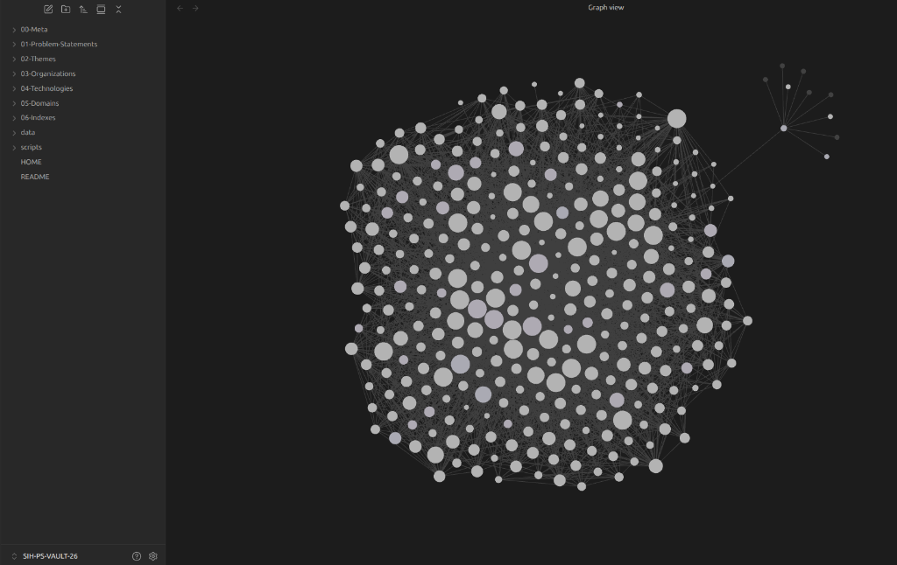

# 🇮🇳 Smart India Hackathon (SIH) 2026 — Problem Statement Vault

[](https://www.sih.gov.in/sih2026PS)
[](06-Indexes/all_problems_index.md)
[](06-Indexes/category_index.md)
[](06-Indexes/category_index.md)
[](02-Themes/theme_index.md)
[](03-Organizations/organization_index.md)

Welcome to the **Smart India Hackathon (SIH) 2026 Problem Statement Vault**. This repository provides an offline-ready, hyperlinked knowledge system containing all **226 official problem statements** released for SIH 2026.

Every problem statement has been cleaned, structured, and cross-indexed by **Theme**, **Organization**, **Technology**, **Domain**, and **Category** with 100% relative Markdown links for seamless navigation on GitHub or in Obsidian.

---

## 📊 Vault Quick Statistics

| Metric | Count | Description |
|--------|------:|-------------|
| **Total Problem Statements** | **229** | Complete official release |
| **Unique Ministry/Org Problems** | **229** | Targeted problem statements |
| **Student Innovation Slots** | **0** | Open-ended AICTE innovation themes |
| **Software Problems** | **175** | Web, Mobile, AI/ML, Cloud, GIS, Data platforms |
| **Hardware Problems** | **54** | Embedded systems, Robotics, Drones, IoT, Sensors |
| **Participating Themes** | **17** | Structured problem domains |
| **Nodal Organizations** | **32** | Central Ministries, PSUs, Industry leaders |

---

## ⚡ Why This Vault Exists: Comparative Evaluation

Why use this Vault instead of searching the official SIH portal directly or asking an LLM with web search capabilities?

The official SIH website (`sih.gov.in/sih2026PS`) relies on dynamic JavaScript HTML modals (`ViewProblemStatementXXXXX`) inside a single long table. Standard search engine crawlers frequently fail to index deep modal text, causing web LLMs to return truncated or incomplete results. Furthermore, the portal UI cannot perform multi-attribute filtering or compute technical similarity.

### 🔍 Feature Comparison Matrix

| Feature / Capability | Live SIH Web Portal | LLM + Direct Web Search | SIH PS Vault 2026 |
| :--- | :---: | :---: | :---: |
| **Complete Dataset Recall (226 PS)** | ⚠️ Manual Page Browsing | ❌ Truncated (Top 10-20 hits) | ✅ **100% Complete & Offline** |
| **Multi-Attribute AND Querying**<br>*(e.g., Software + Healthcare + Dataset + Ministry)* | ❌ Impossible (Single dropdown only) | ❌ Fails / Hallucinates | ✅ **Instant JSON / Index Query** |
| **Derived Technical Taxonomy**<br>*(AI/ML, Computer Vision, GIS, IoT, LiDAR)* | ❌ Not Provided | ⚠️ Unreliable Keyword Matching | ✅ **20 Precomputed Tech Tags** |
| **Sector Domain Taxonomy**<br>*(Healthcare, Defence, Agriculture, Mining)* | ❌ Not Provided | ⚠️ Unreliable Keyword Matching | ✅ **17 Sector Domain Tags** |
| **Precomputed Similarity Graph** | ❌ None | ❌ None | ✅ **Multi-Attribute Overlap Score** |
| **Obsidian Graph Traversal** | ❌ None | ❌ None | ✅ **100% Relative Link Graph** |
| **Air-Gapped / Offline Execution** | ❌ Requires Internet | ❌ Requires Internet | ✅ **100% Offline Autonomy** |
| **Data Provenance & Auditability** | ❌ Overwritten on Live Updates | ❌ Non-reproducible | ✅ **5-Tier Provenance Contract** |

---

## 🕸️ Obsidian Knowledge Graph Visualization

The vault is engineered specifically for graph traversal in **Obsidian**. Every problem statement, ministry, theme, technology stack, and sector domain is linked bi-directionally using 100% relative Markdown links.



> **Figure 1**: Visual representation of the interconnected SIH 2026 knowledge graph in Obsidian. Nodes represent problem statements, nodal ministries, themes, technology stacks, and domain classifications.

---

## 🤖 Launching & Prompting AI Coding Agents

This repository is built agent-native. You can launch AI coding assistants (such as **Gemini Code Assist**, **Cursor**, **Claude Code**, or **AutoGPT**) directly on this codebase to analyze problem statements, generate architectural solutions, or shortlist candidate problems.

### 📜 Agent Governance & Entry Point
All AI agents operating on this repository must read and follow:
1. **[`AGENTS.md`](AGENTS.md)** — Core instructions, fact vs inference classification rules, and non-destructive workflow rules.
2. **[`docs/AGENT-KNOWLEDGE-RULES.md`](docs/AGENT-KNOWLEDGE-RULES.md)** — Knowledge hierarchy and evidence-based citation protocol.

### 💡 Efficient Retrieval Best Practice for Agents
> [!TIP]
> **Token Optimization**: To avoid sequential scanning of all 226 Markdown files (which consumes ~248k tokens), instruct your agent to query **`data/sih2026_problem_statements.json`** or inspect catalog indices (`04-Technologies/`, `05-Domains/`) first!

### 📝 Example Agent Prompts

#### 1. Candidate Problem Shortlisting (Multi-Constraint)
```text
@AGENTS.md Scan data/sih2026_problem_statements.json and find all Software category problem statements in the Healthcare domain that require Computer Vision or AI/ML and have an official dataset link available. Present the results as a table with PS ID, Title, Organization, and Dataset Link.
```

#### 2. Solution Architecture & Feasibility Proposal
```text
@AGENTS.md Read the official problem statement record in 01-Problem-Statements/PS-26001.md. Evaluate its background, description, and expected deliverables. Produce a production-grade system architecture proposal, technology stack recommendation, and risk analysis. Explicitly separate FACT, DERIVED, INFERENCE, and RECOMMENDATION statements.
```

#### 3. Cross-Problem Comparative Analysis
```text
@AGENTS.md Compare PS 26001 and PS 26005 using their underlying records in 01-Problem-Statements/. Analyze overlaps in technology requirements, target sector domains, and nodal organizations, and evaluate whether a modular platform could solve both problems simultaneously.
```

---

## 🧭 Interactive Catalogs & Indexes

Explore the vault using any of the hyperlinked catalogs below:

| Catalog | Link | Description |
|---------|------|-------------|
| 📋 **All Problem Statements** | [all_problems_index.md](06-Indexes/all_problems_index.md) | Complete master table of all 226 problem statements |
| 🏷️ **Themes Catalog** | [theme_index.md](02-Themes/theme_index.md) | Browse problems grouped by 18 official themes |
| 🏢 **Organizations Catalog** | [organization_index.md](03-Organizations/organization_index.md) | Browse problems by Ministry, PSU, or Industry partner |
| 🔧 **Technologies Catalog** | [technology_index.md](04-Technologies/technology_index.md) | Browse problems tagged by AI/ML, IoT, GIS, Robotics, etc. |
| 📊 **Domains Catalog** | [domain_index.md](05-Domains/domain_index.md) | Browse problems by sector (Healthcare, Agriculture, Defence, etc.) |
| ⚙️ **Software vs Hardware** | [category_index.md](06-Indexes/category_index.md) | View Software vs Hardware problem breakdown |

---

## 📂 Repository Architecture

```
SIH-PS-VAULT-26/
├── README.md                      # Public repository overview & quick navigation
├── HOME.md                        # Obsidian Vault dashboard landing page
├── AGENTS.md                      # AI Agent entry point & instructions
├── 00-Meta/
│   ├── DATA-MODEL.md              # Canonical Data Model & Field Ownership Table
│   ├── PROVENANCE.md              # Provenance Levels & Conflict Resolution Protocol
│   ├── TAXONOMY.md                # Official vs Derived Taxonomies Specification
│   ├── GENERATION.md              # Build Pipeline & Path Classifications
│   ├── VALIDATION.md              # Validation Contract & Verification Suite
│   ├── About-This-Vault.md        # Data source, extraction & verification methodology
│   ├── obsidian_graph.png         # Obsidian Knowledge Graph visual snapshot
│   └── ps_template.md             # Clean Problem Statement Markdown template
├── docs/
│   ├── AGENT-KNOWLEDGE-RULES.md   # AI Agent Knowledge Interpretation Rules
│   └── ARCHITECTURE.md            # System Architecture & Layered Model
├── 01-Problem-Statements/         # 226 Problem Statement files (PS-26001.md to PS-26226.md)
├── 02-Themes/
│   ├── theme_index.md             # Master Theme Catalog
│   └── [18 Theme Files].md
├── 03-Organizations/
│   ├── organization_index.md      # Master Organization Catalog
│   └── [30 Org Files].md
├── 04-Technologies/
│   ├── technology_index.md        # Master Technology Catalog
│   └── [20 Tech Files].md
├── 05-Domains/
│   ├── domain_index.md            # Master Domain Classification Index
│   └── [17 Domain Files].md
├── 06-Indexes/
│   ├── all_problems_index.md      # Master Table of all 226 Problem Statements
│   └── category_index.md          # Software vs Hardware problem lists
└── data/
    ├── sih2026_problem_statements.json  # Ground-truth normalized JSON dataset
    └── sih2026_raw.html                 # Raw HTML source snapshot
```

---

## 🚀 How to Use This Vault

### Option 1: Direct GitHub Browsing
- Click any link in [all_problems_index.md](06-Indexes/all_problems_index.md) or [theme_index.md](02-Themes/theme_index.md) to view problem statements directly in GitHub.
- Every note contains relative back-links to return to catalogs or explore related problems.

### Option 2: Obsidian Knowledge Graph
1. Clone this repository to your local machine:
   ```bash
   git clone https://github.com/your-username/SIH-PS-VAULT-26.git
   ```
2. Open **Obsidian** and select **"Open folder as vault"**.
3. Choose the `SIH-PS-VAULT-26` folder.
4. Set `HOME.md` as your homepage note.
5. Open **Graph View** (`Ctrl+G`) to visualize relationships between problem statements, technologies, themes, and organizations.

### Option 3: Command Line / Grep Search
- Search by keyword across all problem statements:
  ```bash
  grep -ri "landslide" 01-Problem-Statements/
  ```
- Find all Hardware problems:
  ```bash
  grep -l "category: "Hardware"" 01-Problem-Statements/*.md
  ```

### Option 4: Launching AI Coding Agents & LLM Pair-Programming
1. Open this repository workspace in your AI coding environment (**Cursor**, **Antigravity**, **Gemini Code Assist**, **Claude Code**, **Windsurf**, or **VS Code + LLM Extension**).
2. Open your agent chat prompt window and ask questions, queries, or research prompts directly in natural language!
3. The AI agent automatically reads the vault's governance rules ([`AGENTS.md`](AGENTS.md)) and structured dataset to fulfill your request.

**Example Prompts to Type Directly to your AI Agent / LLM**:
- 💬 *"Find me all Software problems in Disaster Management that involve Drones or Computer Vision and list their key deliverables."*
- 💬 *"I am leading a team of 4 full-stack developers specializing in React, Node.js, and Python. Recommend the top 3 SIH problem statements that best match our skillset."*
- 💬 *"Read PS-26001.md and generate a complete technical system architecture, database schema proposal, and tech stack recommendation for our submission."*
- 💬 *"Compare PS-26012 and PS-26018 and analyze whether our team can build a single core solution that addresses both problem statements."*


---

## ℹ️ Data Source & Integrity

- **Official Source**: [Smart India Hackathon 2026 Portal](https://www.sih.gov.in/sih2026PS)
- **Verification**: 100% of 226 problem statement modals scraped, cleaned, and encoding-verified. Zero data loss, truncation, or broken references.
- For technical details on data extraction, see [about_vault.md](00-Meta/about_vault.md).

---

*Maintained for SIH 2026 participants, mentors, and innovation researchers.*
