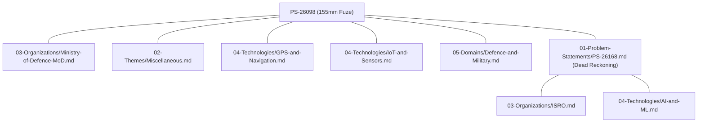

# Agent Retrieval & Knowledge Graph Traversal Protocol

> **SIH PS Vault 2026** · Specification for Agent Navigation, Knowledge Graph Traversal & Provenance-Preserving Retrieval

---

## 1. Purpose & Core Architectural Principles

### 1.1 Purpose
This specification defines the formal retrieval, navigation, and knowledge graph traversal protocol for AI coding agents operating on the **SIH PS Vault 2026** repository.

The goal is to enable AI agents to retrieve problem statements, query taxonomies, traverse entity relationships, and answer complex queries **without reading unnecessary files or performing full-directory scans over the 226 Markdown problem statement records**.

### 1.2 The Three-Layer Architectural Principle
Agents must maintain a strict conceptual separation between three distinct system layers:

```
┌─────────────────────────────────────────────────────────────────────────┐
│ LAYER 1: KNOWLEDGE BASE LAYER                                           │
│ Stores source data, normalized records, and Markdown note representations│
│ • data/sih2026_problem_statements.json (Canonical Ground Truth)        │
│ • 01-Problem-Statements/*.md (Obsidian Markdown Nodes)                  │
│ • 02-Themes/, 03-Organizations/, 04-Technologies/, 05-Domains/           │
└────────────────────────────────────┬────────────────────────────────────┘
                                     │
                                     ▼
┌─────────────────────────────────────────────────────────────────────────┐
│ LAYER 2: RETRIEVAL & NAVIGATION LAYER (This Protocol)                    │
│ Determines HOW an agent locates, filters, and traverses knowledge nodes  │
│ • Direct ID Lookups                                                     │
│ • Structured JSON Filters                                               │
│ • Knowledge Graph Traversal (Obsidian Wiki-Links & JSON Edges)          │
│ • Candidate Shortlisting & Targeted File Opening                        │
└────────────────────────────────────┬────────────────────────────────────┘
                                     │
                                     ▼
┌─────────────────────────────────────────────────────────────────────────┐
│ LAYER 3: AI & REASONING LAYER                                           │
│ Synthesizes retrieved evidence into answers, comparisons & proposals   │
│ • FACT vs. DERIVED FACT vs. INFERENCE vs. RECOMMENDATION                │
│ • Evaluates team fit, feasibility, and solution architectures           │
└─────────────────────────────────────────────────────────────────────────┘
```

> [!CRITICAL]
> **Separation Rule**: Do NOT collapse Layer 2 (Retrieval) into Layer 3 (Reasoning). Retrieval must rely on deterministic source evidence and knowledge graph traversal before any reasoning or inference occurs.

---

## 2. Agent Repository Map

Every directory and critical file in the repository serves a specific role in retrieval, graph navigation, generation, or governance:

| Path / Folder | Purpose | Role | Source / Generated | Authority Level | When Agent Should Read | When Agent Should Avoid | Primary Information Retrieved | Related Files |
| :--- | :--- | :--- | :--- | :--- | :--- | :--- | :--- | :--- |
| `data/sih2026_problem_statements.json` | Canonical ground-truth dataset | Data Source | Source (Normalized) | **Tier 3 (Canonical)** | Filtering multiple PSs, structured search, listing fields | Reading full text of a single known PS (use Markdown) | All 226 PS records, official & derived metadata | `data/sih2026_raw.html` |
| `01-Problem-Statements/*.md` | Individual PS note views | Knowledge Node | Generated | Tier 4 | Deep reading of shortlisted PS, checking exact text, reading callouts | Broad text scanning across all 226 files | Full description, expected outcome, constraints, links | `02-Themes/*.md`, `03-Organizations/*.md` |
| `02-Themes/*.md` | Theme catalog hubs & `theme_index.md` | Catalog / Graph Hub | Generated | Tier 5 | Browsing 18 official themes, finding all PSs under a theme | Single PS lookup | Theme overview, member PS list, link edges | `data/sih2026_problem_statements.json` |
| `03-Organizations/*.md` | Nodal organization hubs | Catalog / Graph Hub | Generated | Tier 5 | Browsing 30 issuing orgs (e.g. ISRO, DRDO, Railways) | General keyword search | Org type, department breakdowns, issued PS list | `00-Meta/TAXONOMY.md` |
| `04-Technologies/*.md` | Technology classification hubs | Catalog / Graph Hub | Generated | Tier 5 (Derived) | Locating PSs using specific tech tags (e.g. `AI-and-ML`) | Checking official SIH source fields | Derived tech member PSs, tag definitions | `scripts/vault_config.py` |
| `05-Domains/*.md` | Sector domain hubs | Catalog / Graph Hub | Generated | Tier 5 (Derived) | Locating PSs in specific sectors (e.g. `Healthcare`) | Checking official SIH source fields | Derived domain member PSs, sector tags | `scripts/vault_config.py` |
| `06-Indexes/*.md` | Master lookup tables | Index | Generated | Tier 5 | High-level navigational browsing, category index checks | Machine-readable programmatic filtering | Summary tables of all 226 PSs | `README.md`, `HOME.md` |
| `00-Meta/DATA-MODEL.md` | Field schema & ownership spec | Specification | Manual | Governance Spec | Checking field ownership, schema types, relationship rules | General PS content search | Data model, schema table, field origins | `00-Meta/PROVENANCE.md` |
| `00-Meta/PROVENANCE.md` | Data authority & conflict spec | Specification | Manual | Governance Spec | Resolving data mismatches, checking trust levels | Standard problem retrieval | Provenance levels, conflict protocols | `00-Meta/VALIDATION.md` |
| `00-Meta/TAXONOMY.md` | Classification system spec | Specification | Manual | Governance Spec | Verifying official vs derived taxonomies, regex rules | Simple category filtering | Category, Theme, Tech, Domain specs | `scripts/vault_config.py` |
| `00-Meta/GENERATION.md` | Pipeline build & path spec | Specification | Manual | Governance Spec | Understanding build stages, file cleanup rules | User query retrieval | Path classifications, generator roles | `scripts/generate_vault.py` |
| `00-Meta/VALIDATION.md` | Verification suite contract | Specification | Manual | Governance Spec | Verifying audit rules, PASS/FAIL criteria | Data retrieval | 6 validation categories, report schema | `scripts/verify_data.py` |
| `docs/ARCHITECTURE.md` | Layered architecture spec | Specification | Manual | Architecture Spec | Reviewing repository system boundaries and layers | Task retrieval | 6-layer model, current vs planned state | `docs/PHASE-2-KNOWLEDGE-MODEL.md` |
| `docs/AGENT-KNOWLEDGE-RULES.md` | AI reasoning governance rules | Specification | Manual | Agent Contract | Reviewing trust classifications (`FACT`, `DERIVED`, etc.) | Data lookup | Statement classification, citation rules | `AGENTS.md` |
| `docs/PHASE-2-KNOWLEDGE-MODEL.md` | Phase 2 architecture report | Report | Manual | Report | Understanding repository evolution & background | Current operations | Phase 2 deliverables summary | `00-Meta/*.md` |
| `AGENTS.md` | Primary entry point & rules | Guidance | Manual | Agent Contract | Initial orientation, reviewing core agent rules | Routine data filtering | Agent core principles, retrieval rules | `docs/AGENT-KNOWLEDGE-RULES.md` |
| `scripts/*.py` | Build, validation & scraper tools | Configuration / Tooling | Manual | Code | Checking how derived metadata is computed or generated | Answering problem statement queries | Generator logic, regex keywords, validator | `00-Meta/GENERATION.md` |

---

## 3. Source Authority & Provenance Specification

### 3.1 Five Provenance Levels
Agents must tag and treat all repository data according to five formal Provenance Levels:

1. **`SOURCE` (100% Trust - Immutable)**: Official metadata extracted directly from SIH 2026 portal.
   * *Fields*: `ps_id`, `title`, `organization`, `department`, `category`, `theme`, `description` (`background`, `description`, `expected_solution`), `dataset_link`, `youtube_link`, `source_url`.
2. **`DERIVED` (80–90% Trust - Vault Analytics)**: Computed by deterministic repository classifiers.
   * *Fields*: `technologies`, `domains`, `organization_type`, `has_dataset`, `aliases`, `related_problems` (`_similar`).
3. **`GENERATED` (100% Regenerable)**: Rendered Markdown views and catalogs generated from canonical JSON.
   * *Paths*: `01-Problem-Statements/*.md`, `02-Themes/*.md`, `03-Organizations/*.md`, `04-Technologies/*.md`, `05-Domains/*.md`, `06-Indexes/*.md`.
4. **`ANALYSIS` (Evaluative Heuristics)**: Scores, complexity assessments, or feasibility evaluations produced by analysis tools or agents.
5. **`RECOMMENDATION` (Inferred Advice)**: Proposed solution architectures, tech stacks, or team-fit matches suggested by AI models.

### 3.2 Six-Tier Authority Hierarchy

```
Tier 1: Official Live SIH Portal (https://www.sih.gov.in/sih2026PS)
         │ [Primary authority when online]
         ▼
Tier 2: Raw Source Snapshot (data/sih2026_raw.html)
         │ [Offline evidence of portal HTML modals]
         ▼
Tier 3: Normalized Ground-Truth Dataset (data/sih2026_problem_statements.json)
         │ [Canonical machine-readable JSON dataset]
         ▼
Tier 4: Vault Problem Statement Notes (01-Problem-Statements/*.md)
         │ [Generated Markdown notes with Obsidian wiki-links]
         ▼
Tier 5: Generated Indexes & Catalogs (02-Themes/, 03-Orgs/, 04-Tech/, 05-Domains/, 06-Indexes/)
         │ [Master lookup tables and catalog hubs]
         ▼
Tier 6: Downstream Inferences & Recommendations
```

> [!WARNING]
> **Derived Metadata Disclaimer**: Derived fields (such as `technologies` and `domains`) are vault enrichment analytics. Agents must NEVER present derived classifications as official SIH portal data.

---

## 4. Progressive Retrieval Hierarchy (Levels 0–6)

When processing a user query, agents must apply the lowest effective retrieval level:

```
LEVEL 0: Direct Lookup ──► exact PS ID known (e.g., PS-26001)
   │
   ├── LEVEL 1: Structured Filtering ──► Category / Theme / Org / Has Dataset
   │      │
   │      ├── LEVEL 2: Taxonomy-Aware Retrieval ──► Tech Tags / Sector Domains
   │      │      │
   │      │      ├── LEVEL 3: Text Search ──► Keyphrase match over description fields
   │      │      │      │
   │      │      │      ├── LEVEL 4: Knowledge Graph Traversal ──► Obsidian wiki-links & related PS
   │      │      │      │      │
   │      │      │      │      ├── LEVEL 5: Candidate Ranking ──► Score & shortlist top candidates
   │      │      │      │      │      │
   │      │      │      │      │      └── LEVEL 6: Semantic Retrieval (Future Extension)
```

### Level 0 — Direct Lookup
* **Trigger**: User provides exact PS ID (`26001`–`26226`, `PS-26001`, `SIH 26001`).
* **Action**: Retrieve target JSON object from `data/sih2026_problem_statements.json` or open `01-Problem-Statements/PS-26001.md`.
* **Prohibited**: Scanning directory files or searching other problem records.

### Level 1 — Structured Filtering
* **Trigger**: Query specifies exact official metadata constraints (Category: `Software`/`Hardware`, Theme: 1 of 18 themes, Organization: 1 of 30 orgs).
* **Action**: Filter `data/sih2026_problem_statements.json` on official schema keys or read corresponding catalog file (e.g. `03-Organizations/Indian-Space-Research-OrganisationISRO.md`).
* **Prohibited**: Opening all 226 Markdown files.

### Level 2 — Taxonomy-Aware Retrieval
* **Trigger**: Query refers to technical concepts (e.g. `AI-and-ML`, `Computer-Vision`) or sectors (e.g. `Healthcare`, `Defence-and-Military`).
* **Action**: Map query terms to Vault derived taxonomy in `00-Meta/TAXONOMY.md` and check catalog hub in `04-Technologies/*.md` or `05-Domains/*.md`.

### Level 3 — Text Search
* **Trigger**: Free-text keywords not covered by taxonomies (e.g. `"potholes"`, `"submarines"`, `"ayurveda"`).
* **Action**: Execute case-insensitive text search over JSON fields (`title`, `description.background`, `description.description`, `description.expected_solution`) to extract candidate PS IDs.

### Level 4 — Knowledge Graph Traversal & Relationship Retrieval
* **Trigger**: Query asks for related problems, organization ecosystem, theme clusters, or shared technology stacks.
* **Action**: Traverse Obsidian Markdown wiki-links (`[[...]]`) or inspect `_similar` graph edges in JSON dataset.

### Level 5 — Ranking & Shortlisting
* **Trigger**: Multi-candidate results (>5 candidates).
* **Action**: Rank candidates deterministically by overlap score (matching categories, tech tags, org, domain) and select top 3–5 candidate PS IDs for deep Markdown reading.

### Level 6 — Semantic Vector Retrieval (Future / Optional)
* **Status**: **PLANNED FOR PHASE 3+**.
* **Constraint**: Vector databases (ChromaDB/Qdrant) and RAG embeddings are NOT present in the current repository. Agents must NOT assume vector search exists.

---

## 5. Knowledge Graph Traversal Specification

The repository forms a fully connected **Obsidian Knowledge Graph** with 226 Problem Statement nodes linked to Theme, Organization, Technology, and Domain nodes.



### 5.1 Graph Node Types
1. **Problem Statement Node (`PS-*.md`)**: Primary entity node. Contains outward links to Org, Theme, Technologies, Domains, and Related PS nodes.
2. **Organization Node (`03-Organizations/*.md`)**: Hub node grouping all PSs issued by a specific ministry/company.
3. **Theme Node (`02-Themes/*.md`)**: Hub node grouping all PSs assigned to one of the 18 official themes.
4. **Technology Node (`04-Technologies/*.md`)**: Hub node grouping PSs matching derived technology keyphrases.
5. **Domain Node (`05-Domains/*.md`)**: Hub node grouping PSs matching derived sector domains.

### 5.2 Traversal Rules (Hop-by-Hop Navigation)
When navigating the knowledge graph:
* **Hop 1 (Direct Neighbor)**: From target PS note, follow Markdown relative links in section `Quick Reference` or `Key Classifications`.
* **Hop 2 (Hub Expansion)**: From a hub node (e.g. `04-Technologies/GPS-and-Navigation.md`), retrieve sibling PS nodes sharing that tag.
* **Hop 3 (Similarity Edge)**: Follow links in section `## 🔗 Related Problem Statements` (e.g., `[PS-26168](../01-Problem-Statements/PS-26168.md)`).

> [!TIP]
> **Graph Traversal Efficiency**: Traversing 2–3 graph hops via hub nodes allows an agent to discover related problem statements in seconds without inspecting unrelated files.

---

## 6. Query Classification & Execution Protocol

Agents must classify incoming user requests into one of 10 formal Query Types:

| Query Type | Recognition Pattern | Primary Source | Execution Protocol | Stop Condition |
| :--- | :--- | :--- | :--- | :--- |
| **1. DIRECT LOOKUP** | Contains explicit PS ID (e.g. `26098`, `PS 26001`) | JSON / Single `.md` | Level 0 lookup directly to target record | Target record retrieved |
| **2. FILTER** | Explicit category/theme/org filter (e.g. "Software from ISRO") | `sih2026_problem_statements.json` | Filter JSON on `category`, `theme`, `organization` | Candidate list produced |
| **3. SEARCH** | Keywords or domain concepts (e.g. "drones for farming") | JSON text fields / Catalogs | Match taxonomy hub + text search in JSON | Candidates ranked & shortlisted |
| **4. DISCOVERY** | Broad exploration (e.g. "What themes exist in SIH?") | `02-Themes/theme_index.md` or `06-Indexes/` | Read index file or summary counts | Summary answer compiled |
| **5. RELATIONSHIP / GRAPH** | Network query (e.g. "What PSs are related to PS-26098?") | `PS-26098.md` links & `_similar` key | Perform 1-2 hop Obsidian graph traversal | Linked nodes retrieved |
| **6. COMPARISON** | Comparing specific PSs (e.g. "Compare PS-26001 and PS-26002") | Shortlisted `.md` files | Read only specified `.md` files & compare schema | Direct comparison rendered |
| **7. ANALYSIS** | Technical feasibility (e.g. "Assess difficulty of PS-26098") | Targeted `.md` file | Read target `.md`, extract requirements, analyze | Analysis clearly tagged as INFERENCE |
| **8. RECOMMENDATION** | Proposal request (e.g. "Recommend AI projects for our team") | JSON filter + targeted `.md` | Filter candidates, read shortlisted `.md`, evaluate | Recommendations tagged as INFERENCE |
| **9. VALIDATION** | Data integrity check (e.g. "Is PS count valid?") | `scripts/verify_data.py` | Check `data/verification_report.json` or run validator | Verdict PASS/FAIL reported |
| **10. ARCHITECTURE** | System design query (e.g. "How is data generated?") | `00-Meta/GENERATION.md` or `docs/ARCHITECTURE.md` | Read corresponding specification doc | Spec explanation provided |

---

## 7. Multi-Constraint Search & Filtering Logic

### 7.1 Constraint Extraction Rule
When a query contains multiple constraints (e.g. *"Find Software problems involving AI for Healthcare from Ministry of Defence"*), the agent must decompose constraints into Boolean logic:

$$\text{Candidate Set} = \text{Category} \cap \text{Organization} \cap \text{Technology} \cap \text{Domain}$$

### 7.2 Execution Order (Selectivity First)
1. **Apply Highest-Selectivity Constraint First**: Filter by exact `organization` or `category` (Official SIH fields).
2. **Apply Derived Taxonomies Second**: Intersect with `technologies` (e.g. `AI-and-ML`) and `domains` (e.g. `Healthcare`).
3. **Apply Keyword Search Last**: Match remaining free-text terms against `description`.
4. **Shortlist Candidate PS IDs**: Select top candidate IDs ($N \le 5$).
5. **Open Markdown Files**: Retrieve full Markdown files ONLY for shortlisted candidate IDs.

---

## 8. Natural Language → Vault Taxonomy Mapping Rules

Agents must map natural language user terms to normalized Vault taxonomy entries defined in `00-Meta/TAXONOMY.md` and `scripts/vault_config.py`:

| User Term / Synonym | Mapped Technology Tag | Mapped Domain Tag | Taxonomy Type |
| :--- | :--- | :--- | :--- |
| "AI", "Machine Learning", "Deep Learning", "LLM", "Neural Network" | `AI-and-ML` | — | Derived Tech |
| "Computer Vision", "Object Detection", "Image Processing", "YOLO" | `Computer-Vision` | — | Derived Tech |
| "NLP", "Text Analysis", "LLM Chatbot", "Translation", "Speech" | `NLP` | — | Derived Tech |
| "IoT", "Sensors", "Microcontroller", "Arduino", "ESP32" | `IoT-and-Sensors` | — | Derived Tech |
| "Blockchain", "Smart Contracts", "Web3", "Distributed Ledger" | `Blockchain` | — | Derived Tech |
| "GIS", "Maps", "Geospatial", "Remote Sensing", "Satellite Images" | `GIS-and-Geospatial` | — | Derived Tech |
| "Robotics", "Autonomy", "Rover", "Manipulator" | `Robotics` | — | Derived Tech |
| "Drones", "UAV", "Aerial Vehicles" | `Robotics` | `Defence-and-Military` / `Agriculture` | Derived Tech & Domain |
| "Cloud", "AWS", "Azure", "Serverless" | `Cloud-Computing` | — | Derived Tech |
| "Mobile App", "Android", "iOS", "Flutter" | `Mobile-Development` | — | Derived Tech |
| "Web App", "Portal", "Dashboard", "React", "Node" | `Web-Platforms` | — | Derived Tech |
| "Cybersecurity", "Encryption", "Malware", "Network Security" | `Cybersecurity-Tech` | — | Derived Tech |
| "Hospital", "Medical", "Ayush", "Disease", "Patient" | — | `Healthcare` | Derived Domain |
| "Farming", "Crops", "Soil", "Agriculture", "Irrigation" | — | `Agriculture` | Derived Domain |
| "Army", "Navy", "Air Force", "Defence", "Military", "Missile" | — | `Defence-and-Military` | Derived Domain |
| "Police", "Crime", "Forensics", "Surveillance" | — | `Law-Enforcement` | Derived Domain |

> [!IMPORTANT]
> **Ambiguity Rule**: If a user term maps to multiple possible taxonomies (e.g. "Drones" matching both `Robotics` and `Space-Technology` theme), the agent must check both taxonomy catalogs or report the ambiguity. Never silently invent new taxonomy tags.

---

## 9. Markdown Retrieval Policy & Traversal Hops

### 9.1 The Fundamental Rule
**Agents MUST NOT open or read all 226 Markdown problem statement files to perform search, filtering, or discovery.**

### 9.2 Standard Markdown Retrieval Workflow

```
[USER QUERY]
     │
     ▼
[Step 1: JSON Filter / Taxonomy Catalog Match]
     │
     ▼
[Step 2: Candidate PS IDs Extracted (e.g. PS-26001, PS-26098)]
     │
     ▼
[Step 3: Open ONLY Candidate .md Files]
     │
     ▼
[Step 4: Execute Deep Reading & Answer Synthesis]
```

### 9.3 Valid Triggers for Opening Markdown Notes
1. Direct User Request for a specific PS ID (`PS-26098`).
2. Candidate PS ID shortlisted after Level 1–3 filtering ($N \le 5$).
3. Graph Traversal Hop following relative links in a known PS note.
4. Comparing specific shortlisted problem statements.

---

## 10. Index & Catalog Usage Specification

The repository provides master indices in `06-Indexes/` and catalog hubs in `02-Themes/`, `03-Organizations/`, `04-Technologies/`, and `05-Domains/`:

### 10.1 Navigational vs. Authoritative Distinction
* **`06-Indexes/all_problems_index.md` & `category_index.md`**: Generated summary tables. Use for quick human/agent visual checks.
* **Catalog Hubs (`02-Themes/*.md`, `03-Orgs/*.md`, etc.)**: Obsidian graph hubs. Use for graph traversal and identifying all PSs in a category.
* **`data/sih2026_problem_statements.json`**: Authoritative dataset. Use for programmatically exact filtering.

---

## 11. Metadata & Documentation Lookup Rules

Agents must NOT read all specification files in `00-Meta/` or `docs/` for routine queries. Use task-triggered reading rules:

| User Task / Question | Document to Read | Primary Information |
| :--- | :--- | :--- |
| "What fields exist in a problem statement?" | `00-Meta/DATA-MODEL.md` | Schema types, field ownership table |
| "Is this technology tag official SIH data?" | `00-Meta/PROVENANCE.md` | Provenance levels, trust hierarchy |
| "What technology regex keywords are used?" | `00-Meta/TAXONOMY.md` | Regex rules, taxonomy specs |
| "How are generated files built or cleaned?" | `00-Meta/GENERATION.md` | Build stages, stale artifact cleanup |
| "How do I validate the repository dataset?" | `00-Meta/VALIDATION.md` | 6 check categories, audit rules |
| "What is the system architecture?" | `docs/ARCHITECTURE.md` | Layered architecture model |
| "How should an agent categorize claims?" | `docs/AGENT-KNOWLEDGE-RULES.md` | Trust levels (`FACT`, `DERIVED`, etc.) |
| "What rules govern repository maintenance?" | `AGENTS.md` | Core principles, safety rules |

---

## 12. Agent File-Reading Policy (DOs and DO NOTs)

### ✅ DO
* **Identify task intent first** before reading files.
* **Use `data/sih2026_problem_statements.json`** for structured multi-constraint filtering.
* **Traverse Obsidian links node-by-node** for relationship queries.
* **Open Markdown notes ONLY for candidate PS IDs** after filtering ($N \le 5$).
* **Categorize output statements** into `FACT`, `DERIVED FACT`, `INFERENCE`, `RECOMMENDATION`.
* **Cite exact PS IDs** (`PS-26098`) in final answers.

### ❌ DO NOT
* **DO NOT read all 226 Markdown files** in `01-Problem-Statements/` for search/filtering.
* **DO NOT present derived technology/domain tags** as official SIH metadata.
* **DO NOT manually edit generated Markdown files** in catalog or problem directories.
* **DO NOT invent missing fields** or background text.
* **DO NOT assume vector search or RAG embeddings exist** in the repository.
* **DO NOT silently overwrite conflicting data**.

---

## 13. Stop Conditions & Exit Criteria

An agent must terminate retrieval as soon as exit criteria are met:

```
Direct PS Query ──────► Open target PS note ──────────► Stop (Do not scan other PS files)
Category Filter ──────► Filter JSON dataset ─────────► Stop (Return list of PS IDs & titles)
Graph Query ──────────► Traverse 1-2 hop wiki-links ─► Stop (Return connected graph nodes)
Validation Request ───► Read verification_report.json► Stop (Report verdict PASS/FAIL)
```

---

## 14. Operational Agent Retrieval Algorithm

Every coding agent must execute this 13-step algorithm when processing requests:

```
Step 1: Parse user prompt and identify core intent.
Step 2: Classify query into 1 of 10 Query Types (Section 6).
Step 3: Check if exact PS ID is provided -> If YES, perform Level 0 Direct Lookup & STOP.
Step 4: Extract explicit constraints (Category, Org, Theme, Tech, Domain).
Step 5: Map natural language terms to Vault taxonomy (Section 8).
Step 6: Select lowest applicable Retrieval Level (Levels 1-4).
Step 7: Execute structured filtering over `data/sih2026_problem_statements.json` or catalog hub.
Step 8: Extract candidate PS IDs (target N <= 5).
Step 9: If relationship query, perform 1-2 hop Obsidian graph link traversal.
Step 10: Retrieve full Markdown notes ONLY for candidate PS IDs.
Step 11: Verify facts against official JSON fields and check provenance.
Step 12: Rank candidates and synthesize answer.
Step 13: Tag claims (FACT/DERIVED/INFERENCE) and STOP.
```

---

## 15. Retrieval & Knowledge Graph Traversal Decision Tree

```
                      USER QUERY
                           │
             ┌─────────────┴─────────────┐
             ▼                           ▼
      Has Exact PS ID?          No Exact PS ID
             │                           │
     ┌───────┴───────┐           ┌───────┴───────┐
     ▼               ▼           ▼               ▼
YES (Level 0)     NO (Lookup) Structured?      Free-Text/Graph?
     │                           │               │
  Open JSON/      Map to taxonomy │           ┌───┴───┐
  PS-*.md          & filter JSON │           ▼       ▼
     │                           │        Graph?   Text Search?
     ▼                           ▼           │       │
   STOP                     Candidate IDs   1-2 Hop  Search JSON
                                 │          Obsidian fields
                                 ▼          Links    │
                         Open Shortlisted    │       ▼
                            PS Notes         ▼   Candidate IDs
                                 │       Candidate    │
                                 ▼          IDs       ▼
                               Synthesize    │    Open Shortlist
                                Answer ◄─────┴───► PS Notes
                                 │                    │
                                 ▼                    ▼
                               Tag Claims & Stop ◄────┘
```

---

## 16. Agent Quick Reference ("WHERE DO I GO?")

```
Programmatic Data Filtering ──► data/sih2026_problem_statements.json
Detailed Single Problem ──────► 01-Problem-Statements/PS-[ID].md
Theme Browsing ───────────────► 02-Themes/theme_index.md & 02-Themes/[Theme].md
Organization Browsing ────────► 03-Organizations/organization_index.md & 03-Organizations/[Org].md
Technology Tag Browsing ──────► 04-Technologies/technology_index.md & 04-Technologies/[Tech].md
Sector Domain Browsing ───────► 05-Domains/domain_index.md & 05-Domains/[Domain].md
Master Tables & Summary ──────► 06-Indexes/all_problems_index.md
Data Model & Schema Spec ─────► 00-Meta/DATA-MODEL.md
Provenance & Trust Spec ──────► 00-Meta/PROVENANCE.md
Taxonomy & Regex Rules ───────► 00-Meta/TAXONOMY.md
Build Pipeline Spec ──────────► 00-Meta/GENERATION.md
Validation Contract ──────────► 00-Meta/VALIDATION.md
System Architecture ──────────► docs/ARCHITECTURE.md
Agent Governance Rules ───────► docs/AGENT-KNOWLEDGE-RULES.md & AGENTS.md
Data Verification Tool ───────► python3 scripts/verify_data.py
Vault Rebuild Tool ───────────► python3 scripts/generate_vault.py
```

---

## 17. Realistic Scenario Examples (15 End-to-End Walkthroughs)

### Example 1: Exact PS Lookup
* **User Query**: *"Get details for PS-26098"*
* **Query Type**: DIRECT LOOKUP (Level 0)
* **Execution**: Open `01-Problem-Statements/PS-26098.md` directly.
* **Candidate Files**: `01-Problem-Statements/PS-26098.md` (1 file).
* **Final Answer Source**: `PS-26098.md` official fields.

### Example 2: Category Filtering
* **User Query**: *"List hardware problem statements"*
* **Query Type**: FILTER (Level 1)
* **Execution**: Filter `data/sih2026_problem_statements.json` where `category == "Hardware"`.
* **Candidate Files**: None (JSON dataset filtered in memory).
* **Final Answer Source**: JSON dataset (Returns 54 hardware PS IDs and titles).

### Example 3: Organization Filtering
* **User Query**: *"Find all problem statements issued by DRDO"*
* **Query Type**: FILTER (Level 1)
* **Execution**: Read `03-Organizations/DRDO.md` or filter JSON where `organization == "DRDO"`.
* **Candidate Files**: `03-Organizations/DRDO.md`.
* **Final Answer Source**: `DRDO.md` catalog hub node.

### Example 4: Derived Technology Filtering
* **User Query**: *"Find problems requiring AI and Machine Learning"*
* **Query Type**: TAXONOMY-AWARE RETRIEVAL (Level 2)
* **Execution**: Read catalog `04-Technologies/AI-and-ML.md` or filter JSON where `"AI-and-ML" in technologies`.
* **Candidate Files**: `04-Technologies/AI-and-ML.md`.
* **Final Answer Source**: Technology catalog hub node.

### Example 5: Sector Domain Filtering
* **User Query**: *"Find healthcare-related problems"*
* **Query Type**: TAXONOMY-AWARE RETRIEVAL (Level 2)
* **Execution**: Read `05-Domains/Healthcare.md` or filter JSON where `"Healthcare" in domains`.
* **Candidate Files**: `05-Domains/Healthcare.md`.
* **Final Answer Source**: Domain catalog hub node.

### Example 6: Multi-Constraint Search
* **User Query**: *"Find Software problems involving AI for Healthcare"*
* **Query Type**: FILTER / SEARCH (Level 1+2)
* **Execution**: Filter JSON: `category == "Software"` AND `"AI-and-ML" in technologies` AND `"Healthcare" in domains`.
* **Candidate Files**: Open shortlisted PS Markdown files (`PS-26001.md`, `PS-26003.md`, etc.).
* **Final Answer Source**: Shortlisted candidate PS Markdown notes.

### Example 7: Free-Text Search
* **User Query**: *"Find problems dealing with underwater acoustic signals"*
* **Query Type**: TEXT SEARCH (Level 3)
* **Execution**: Search JSON fields `title` and `description` for `"acoustic"` / `"underwater"`. Mapped candidate: `PS-26168` / `Sonar-Acoustics`.
* **Candidate Files**: `04-Technologies/Sonar-Acoustics.md` and matching candidate PS notes.
* **Final Answer Source**: Matching candidate PS Markdown records.

### Example 8: Knowledge Graph Traversal
* **User Query**: *"Find problems related to PS-26098 via graph traversal"*
* **Query Type**: RELATIONSHIP / GRAPH (Level 4)
* **Execution**: Open `PS-26098.md`. Read section `## 🔗 Related Problem Statements`. Hop to linked neighbor `PS-26168.md`.
* **Candidate Files**: `PS-26098.md` ➔ `PS-26168.md` (2 files).
* **Final Answer Source**: Obsidian graph wiki-links.

### Example 9: Problem Comparison
* **User Query**: *"Compare PS-26001 and PS-26002"*
* **Query Type**: COMPARISON
* **Execution**: Read `01-Problem-Statements/PS-26001.md` and `PS-26002.md`.
* **Candidate Files**: `PS-26001.md`, `PS-26002.md` (2 files).
* **Final Answer Source**: Side-by-side comparison of official fields and derived metadata.

### Example 10: AI Team Project Recommendation
* **User Query**: *"Recommend 3 software projects for a mobile app development team"*
* **Query Type**: RECOMMENDATION
* **Execution**: Filter JSON for `category == "Software"` AND `"Mobile-Development" in technologies`. Shortlist top 3 records. Tag evaluation as `RECOMMENDATION`.
* **Candidate Files**: 3 shortlisted PS Markdown files.
* **Final Answer Source**: Shortlisted records with explicit `RECOMMENDATION` tag.

### Example 11: Checking Field Provenance
* **User Query**: *"Is the Computer Vision classification on PS-26001 official SIH data?"*
* **Query Type**: ARCHITECTURE / PROVENANCE
* **Execution**: Check `00-Meta/PROVENANCE.md` or `00-Meta/DATA-MODEL.md`.
* **Final Answer Source**: `PROVENANCE.md` (State that `technologies` are Vault-derived analytics, NOT official SIH data).

### Example 12: Understanding Vault Architecture
* **User Query**: *"Explain the layered system model of this vault"*
* **Query Type**: ARCHITECTURE
* **Execution**: Read `docs/ARCHITECTURE.md`.
* **Final Answer Source**: `docs/ARCHITECTURE.md` (6-layer model).

### Example 13: Repository Data Validation
* **User Query**: *"Validate the integrity of the problem statement dataset"*
* **Query Type**: VALIDATION
* **Execution**: Read `data/verification_report.json` or state execution of `python3 scripts/verify_data.py`.
* **Final Answer Source**: `data/verification_report.json` (Verdict: PASS).

### Example 14: Tracking Field Ownership
* **User Query**: *"Where does the dataset_link field originate?"*
* **Query Type**: ARCHITECTURE / PROVENANCE
* **Execution**: Read `00-Meta/DATA-MODEL.md` Section 3 (Field Ownership Table).
* **Final Answer Source**: `00-Meta/DATA-MODEL.md` (Official portal field).

### Example 15: Pipeline Rebuild Instructions
* **User Query**: *"How are generated Markdown files rebuilt?"*
* **Query Type**: ARCHITECTURE
* **Execution**: Read `00-Meta/GENERATION.md`.
* **Final Answer Source**: `00-Meta/GENERATION.md` (`python3 scripts/generate_vault.py`).

---

## 18. Failure & Ambiguity Handling Protocol

When an agent encounters ambiguous or missing data:

1. **Zero Candidates Found**:
   * Do NOT fabricate a response.
   * Broaden filter constraints (e.g. drop domain constraint, keep category + technology).
   * Report to user: *"No exact match found for specified constraints. Broadened search returned candidate PS-XXXXX."*
2. **Over-Abundance of Candidates (>20 matches)**:
   * Do NOT open 20 Markdown files.
   * Group candidates by Theme or Organization and present high-level catalog hubs (`02-Themes/*.md`).
3. **Ambiguous Natural Language Term**:
   * Inspect `00-Meta/TAXONOMY.md`.
   * Present options matching potential taxonomies.
4. **Source vs. Generated Discrepancy**:
   * Follow `00-Meta/PROVENANCE.md` conflict protocol: `sih2026_problem_statements.json` is CANONICAL over Markdown files.

---

## 19. Design for Future Retrieval Engine Interface

In future phases (Phase 3+), a formal programmatic Retrieval Engine may be implemented. This protocol defines its conceptual signature contract:

```python
# Conceptual Signature Contract (Specification Only - DO NOT IMPLEMENT NOW)

def get_problem(ps_id: str) -> dict:
    """Retrieve canonical JSON record for a specific PS ID."""

def filter_problems(category: str = None, theme: str = None, organization: str = None,
                    technology: str = None, domain: str = None) -> List[dict]:
    """Filter problems by official metadata and derived taxonomy tags."""

def search_problems(query: str, fields: List[str] = None) -> List[dict]:
    """Execute text search across title, background, description, and expected solution."""

def traverse_graph(ps_id: str, hops: int = 1) -> dict:
    """Traverse Obsidian knowledge graph edges starting from a target PS node."""

def get_catalog(catalog_type: str, name: str) -> dict:
    """Retrieve catalog hub members for theme, org, technology, or domain."""
```

> [!NOTE]
> **Unified Interface Vision**: CLI tools, REST APIs, and Model Context Protocol (MCP) servers in downstream systems can all bind to this identical retrieval specification.

---

## 20. Verified Repository Facts

The following facts have been strictly verified against the active repository state:

1. **Total Problem Statements**: Exactly 226 (`PS-26001` to `PS-26226`).
2. **Canonical Ground Truth**: `data/sih2026_problem_statements.json`.
3. **Raw Offline Snapshot**: `data/sih2026_raw.html`.
4. **Categories**: `Software` (172 records), `Hardware` (54 records).
5. **Official Themes**: 18 distinct SIH 2026 themes in `02-Themes/`.
6. **Official Organizations**: 30 issuing organizations in `03-Organizations/`.
7. **Derived Technologies**: 20 keyphrase tags defined in `scripts/vault_config.TECH_KEYWORDS`.
8. **Derived Domains**: 17 sector classifications defined in `scripts/vault_config.DOMAIN_KEYWORDS`.
9. **Link Integrity**: 0 broken relative links across 333 Markdown files (`scripts/verify_data.py`).

---

## 21. Design Recommendations & Future Work

1. **Phase 3 Downstream Intelligence**: Implement programmatic Python helper functions in `scripts/` matching the conceptual retrieval engine interface.
2. **MCP Server Integration**: Package the retrieval engine as a Model Context Protocol (MCP) tool server for external AI coding assistants.
3. **Hybrid Semantic Search**: Evaluate lightweight local embeddings (e.g. `fastembed` / `chromadb`) strictly as Layer 6 extensions without mutating Layer 1–5 core files.
